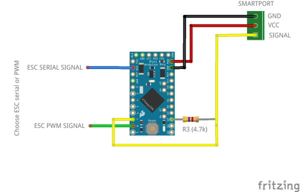
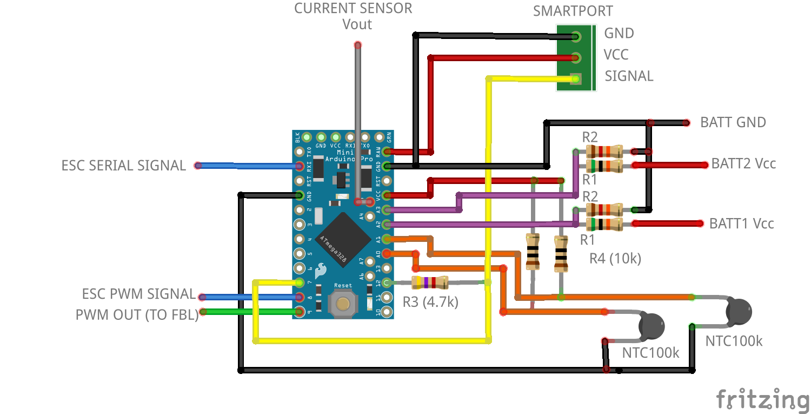
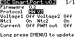

# ESC telemetry to FrSky Smartport

This is a DIY project to send ESC telemetry and optionally other sensors to Frsky Smartport using an Arduino Pro Mini 168 or 328P (3.3v or 5v)

## Telemetry

The ESC telemetry can be ESC serial data or PWM signal (from the ESC or RPM sensor)

ESC protocols implemented:

- Hobbywing Platinum V3: RPM
- Hobbywing Platinum V4, Hobbywing Flyfun V5: RPM, temperature, voltage and current
- PWM signal: RPM

Average cell voltage for HW V4/V5 is calculated for 3S,4S,5S,6S,7S,8S,10S and 12S batteries. Two seconds after power on cell count is autodetected and fixed (average cell voltage to be >3.8v for proper cell count)

Optionally you can add the following analog sensors:

- 2 x voltage divider can be added to read the battery voltage
- Current sensor
- 2 x temperature sensors (thermistors)

New protocols request : if you wish to add suport for a new ESC protocol you can use the sniffer [sketch](./sniffer/sniffer.ino), connect to your ESC and post or pm me the output at:

[Helifreak](https://www.helifreak.com/showthread.php?t=835243)

[Openrcforums](https://www.openrcforums.com/forum/viewtopic.php?f=84&t=11911)

## PWM output

PWM signal generation from ESC serial (some HW V5 don't have RPM PWM output) 

PWM signal properties: logic level 3.3V and default duty cycle 50%

## Minimum circuit

The arduino has to be connected at least to the ESC serial port or a PWM signal (from the ESC or RPM sensor)

 - SmartPort Vcc to Arduino RAW
 - SmartPort Gnd to Arduino Gnd
 - Smartport Signal to Arduino PIN_SMARTPORT_RX (7)
 - Smartport Signal to R3 (4.7k)
 - R3 (4.7k) to Arduino PIN_SMARTPORT_TX (12)
 - If using ESC serial: ESC serial signal to Arduino Rx
 - If using ESC PWM: ESC PWM signal to Arduino PIN_PWM_ESC (8)

 
  <i>Minimum circuit</i>  

## Additional analog sensors

Optionally you can add any of the following analog sensors:

- 2 x voltage divider can be added to read the battery voltage
- Current sensor
- 2 x temperature sensors (thermistors)

 
  <i>Full circuit</i>  

## Flash to Arduino

Using Arduino IDE copy folder *esc_smartport* and open *esc_smartport.ino*. Select board *Arduino Pro or Pro Mini*, processor *ATMega168 or ATMega328P (3.3V 8MHz or 5V 16MHz)* and flash

## Configuration

The configuration is modified with a lua script (X7, X9, X-lite and Horus with openTx 2.2 or higher)

Copy the file escSp.lua to the SCRIPTS folder in the sdcard of the Tx and execute as one-time script from SD-HD-CARD screen (long press and Execute). It can be executed also as telemetry script if copied to TELEMETRY folder and assigned to a model telemetry screen

If not using lua script comment *#define CONFIG_LUA* and assign values, lines 219-237, in esc_smartport.h

Options:

- ESC protocol. HobbyWing Platinum V3, HobbyWing Platinum V4/Hobbywing Flyfun V5 or PWM signal
- Voltage1. For voltage divider 1
- Voltage2. For voltage divider 2
- Ntc1. Thermistor 1
- Ntc2. Thermistor 2
- Current
- PWM out. To generate PWM output from ESC serial  (for obbywing Flyfun V5)
- Averaging queue size: 1 to 16
- Refresh rate (ms): 0 to 1600

## OpenTx sensors

The arduino default sensor id is 10

Depending on your configuration you may have some or all of the following sensors in Opentx:
 
- RPM: EscR (0x0b60)
- ESC voltage: EscV (0x0b50)
- ESC cell average: VFAS (0x0210)
- ESC current: EscA (0x0b50)
- ESC temp1: EscT (0x0b70)
- ESC temp2: EscT (0x0b71)
- Voltage 1: A3 (0x0900)
- Voltage 2: A4 (0x0910)
- Thermistor 1: Tmp1 (0x0400)
- Thermistor 2 : Tmp2 (0x0410)
- Current: Curr (0x020f)

Some of them needs to be adusted

### Adjust RPM sensor (EscR)

- Blades/poles: number of pair of poles * main gear teeth  
- Multiplier: pinion gear teeth

### Adjust voltage sensors (A3, A4)

Measure the voltage of the battery with a voltmeter and adjust *Ratio* in A3 sensor

### Adjust current sensor (Curr)

Adjust sensor ratio: *1000 / output sensitivity (mV/A)*

To get battery consumption add a new sensor:

- Type: Calculated
- Formula: Consumption
- Sensor: Curr

## Images

 

## Video

[Video](https://youtu.be/Mby2rlmAMlU)

## Annex

### ESC protocol specifications

Serial parameters:

- 19200 bps
- 1 packet every 20 ms
- Big endian

#### Hobbywing V3

Byte | 1 | 2 | 3 | 4 | 5 | 6 | 7 | 8 | 9 | 10
--- | --- | --- | --- | --- | --- | --- | --- | --- | --- | ---
Value | Package Head (0x9B) | Package Number 1 | Package Number 2 | Package Number 3 | Rx Throttle 1 | Rx Throttle  2 | Output PWM 1 | Output PWM 2 | RPM Cycle 1 | RPM Cycle 2

*RPM = 60000000 / RPM Cycle*

#### Hobbywing V4/V5

Byte | 1 | 2 | 3 | 4 | 5 | 6 | 7 | 8 | 9 | 10 | 11 | 12 | 13 | 14 | 15 | 16 | 17 | 18 | 19
--- | --- | --- | --- | --- | --- | --- | --- | --- | --- | --- | --- | --- | --- | --- | --- | --- | --- | --- | ---
Value | Package Head (0x9B) | Package Number 1 |	Package Number 2 | Package Number 3	| Rx Throttle 1	| Rx Throttle  2 | Output PWM 1 | Output PWM 2	| RPM 1 | RPM 2	| RPM 3	| Voltage 1 |	Voltage 2	| Consumption 1	| Consumption 2	| Temp1 1	| Temp1 2	| Temp2 1 |	Temp2 2

Remarks:

1. Multipliers: Voltage 1/113, current 1/100(?), temperatures 1/100(?)

2. There are two temperatures values. No idea what's the difference

3. Before throttle is raised from 0, programming packets are sent between telemetry packets:

Byte | 1 | 2 | 3 | 4 | 5 | 6 | 7 | 8 | 9 | 10 | 11 | 12 | 13
--- | --- | --- | --- | --- | --- | --- | --- | --- | --- | --- | --- | --- | ---
Value | 0x9B | 0x9B	| 0x3	| 0xE8	| 0x1	| 0xB	| 0x41	| 0x21	| 0x44	| 0xB9	| 0x21	| 0x21	| 0xB9

### Analog voltage sensors. Voltage divider circuit

Two battery voltages can be measured through the analog pins A2 and A3
Metal resistors are recommended as gives more accurate readings (0.1W or higher)
Arduino can read up to 3.3V/5V and is optimized for signal inputs with 10K impedance

To select R values apply formulas:

*Vo = Vi\*R2/(R1+R2) < 3.3V or 5V*

*Z = 1/((1/R1)+(1/R2)) < 10K*

For 6S battery (or lower) and Pro Mini 3.3v:

 - R1 68k
 - R2 10k

If more than 6S change R values or you may burn the Arduino!

### Temperature sensors. Thermistors

Two temperature sensors can be installed through the analog pins A0 and A1
Temperature is measured with NTC thermistors (100k). Adjust thermistor Beta in esc_smartport.h if needed (NTC_BETA, default is 4190). Sensor output in Celsius

Using Beta formula:

*T = 1/[ln(R/Ro)/B+1/To]*

More accurate formula (Steinhart and Hart Equation) if data available:

*T = 1/[A+Bln(R/Ro)+Cln(R/Ro)²+Dln(R/Ro)³]*

## Change log

v0.3.1

- Added cell voltage average (HW V4/V5, VFAS sensor)
- Fixed esc current sensor bug (HW V4/V5)
- Adjusted multiplier for esc voltage (HW V4/V5)

v0.3

- Esc current sensor (EscA) added (HW V4/V5, >60A)
- Averaging telemetry added
- Voltage2 sensor changed from A3 to A4
- Ntc2 sensor changed from Tmp1 to Tmp2
- Averaging governor added
- Refresh rate and averaging added to lua config script
