# MSRC - Multi Sensor for RC - Smartport, Frsky D, XBUS, SRXL, IBUS

This is a DIY project to send sensors telemetry for a fraction of the weight and cost of the stock sensors. It adds support for several ESC telemetry protocols

Compatible RX protocols: Frsky Smartport, FrSky D, Spektrum XBUS, Spektrum SRXL V5, Flysky IBUS

Compatible ESCs: Hobbywing V3/V4/V5, Kontronik, Castle Link

Compatible MCUs: ATmega328P, ATmega328PB, ATmega2560 and ATmega32U4 and Teensy LC/3.x

Implemented sensors:

- ESC
  - ESCs with serial telemetry (Hobbywing V3/V4/V5, Kontronik)
  - ESC with PWM signal or phase sensor
  - ESC Castle Link
- GPS serial (NMEA)
- I2C sensors: BMP280
- Analog sensors: voltage, temperature, current, air speed

All sensors are optional. Make the circuit with the desired sensors and enable them in the configuration, with a lua script if using smartport or in config.h for the rest of Rx protocols 

## 1. Boards

### 1.1 MCU

| MCU | Recommended board | Castle telemetry | UART(1) | Inverted UART(2) |
| :---: | :---: | :---: | :---: | :---: |
| ATmega328P | Arduino Pro Mini(5) | Innacurate | 1 | :x: |
| ATmega328PB | Pololu ATmega328PB(5) | :white_check_mark: | 2 | :x: |
| ATmega2560 | ATmega2560 Pro Mini | :white_check_mark: | 4 | :x: |
| ATmega32U4(3) | Teensy 2 | :white_check_mark: | 1 | :x: |
| ARM CortexM0+ | Teensy LC(4) | :white_check_mark: | 3 | :white_check_mark: |
| ARM CortexM4 | Teensy 3.2 | :white_check_mark: | 3 | :white_check_mark: |

(1) 2 x UARTS allows to use ESC serial and GPS at the same time  
(2) Allows to use hardware serial for Smartport  
(3) Arduino Micro is not supported  
(4) Teensy LC is not 5v tolerant. If using with Castle is preferred Teensy 3.2, which is 5v tolerant  
(5) Arduino Pro Mini and Pololu ATmega328PB requires a USB-TTL programmer for flashing

ATmega boards at 5v (16Mhz) may not read properly serial port when using ESC serial or GPS as they use 3.3v logic level and Arduino 5v. In this case if using 5v it is better without USB (Pro Mini) and/or use software serial. If using ATmega board, is preferred 3.3v (8Mhz) boards

### 1.2 Connections

| Board | Arduino Pro Mini | Pololu ATmega328PB | Arduino ATmega2560 | Teensy 2 | Teensy LC Teensy 3.x |
| :---: | :---: | :---: | :---: | :---: | :---: |
| MCU | ATmega328P | ATmega328PB | ATmega2560 | ATmega32U4 | ARMCortexM0+ ARMCortexM4 |
| NTC 1 | A0 | A0 | A0 | F6(A1) | 14 |
| NTC 2 | A1 | A1 | A1 | F7(A0) | 15 |
| Voltage 1 | A2 | A2 | A2 | F5(A3) | 16 |
| Voltage 2 | A3 | A3 | A3 | F4(A2) | 17 |
| Current | A6 | A6 | A6 | B5(A9) | 20 |
| Airspeed | A7 | A7 | A7 | D7(A7) | 26 |
| ESC serial | RX | RX0 | 19 | D2(RX1) | 9 |
| GPS | RX | RX1 | 17 | D2(RX1) | 7 |
| PWM in | 8 | 8 | 49 | D4(A6) | 6 |
| PWM out | 10 | 10 | 7 | B6(A10) | 22 |
| Rx Castle | 8 | 8 | 49 | C7 | 16 |
| ESC Castle(1) | 2 & 10 | 2 & 22 | 45 & 48 | C8 & B6 | 2 & 6 |
| Frsky D, Smartport or SRXL | 7 & 12(2) | 4 & 23(2) | 10 & 15(2) | B2 & B4(2) (16 & 8) | 0 & 1(2) |
| XBUS or sensor SDA | A4 | A4 | 20 | D1(2) | 18 |
| XBUS or sensor SCL | A5 | A5 | 21 | D0(3) | 19 |

(1) with pull up 3.3k  
(2) with resistor 3.3k

## 2. Receiver protocol

The following Rx protocols are supported:

- Frsky Smartport : inverted serial, 57600 bps
- Frsky D : inverted serial, 9200 bps
- Spektrum SRXL V5: serial, 115200 bps
- Spektrum XBUS: I2C
- Flysky IBUS: serial, 115200 bps

Depending on the receiver protocol connect to the Rx as follows

### Frsky D, Smartport, SRXL and IBUS

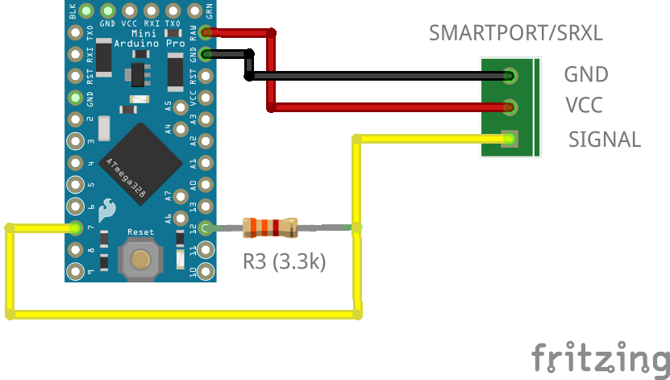 
  <i>Frsky D, Smartport, SRXL or IBUS</i>  

  Frsky D: Signal = Rx

### XBUS

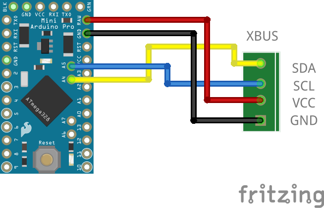 
  <i>XBUS</i>  

## 3. Sensors

### 3.1. ESC

#### Serial telemetry

Compatible ESC serial protocols: Hobbywing V3/V4/V5 and Kontronik

Optionally a PWM signal can be generated from the RPM value in serial telemetry

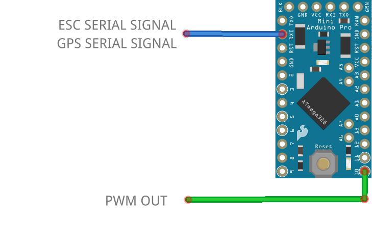 
  <i>ESC serial</i>  

Remark:
 - In HW V3 the telemetry port is the program port. It is a servo male plug on the ESC
 - In HW V4/V5 the telemetry port is a wired servo female plug. Don't confuse with RPM PWM signal connector or the program port
 - For HW ESCs be sure the firmware installed is NOT VBAR version

#### PWM signal

If the ESC have a PWM signal or a phase sensor is installed, RPMs can be measured. If ESC have both serial and PWM signal, like Hobbywing V4/V5, then PWM signal is not needed for telemetry

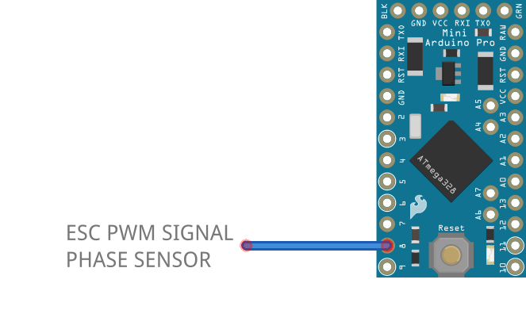 
  <i>PWM signal/phase sensor circuit</i>  

#### Castle link

The telemetry is send over the ESC signal. *Castle Link* has to be enabled in the ESC config

If using ATmega328P telemetry values are not accurate all the time. Some readings are increased by 5-10%. This is a hardware limitation

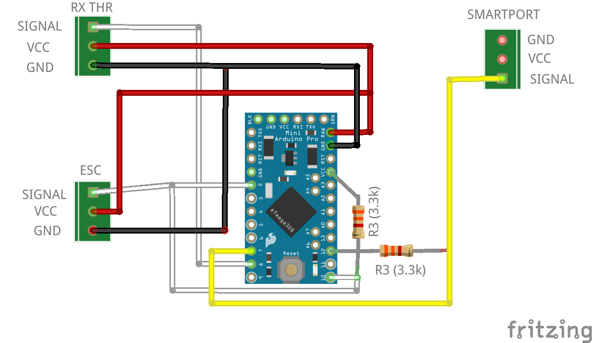 
  <i>Castle Link with Smartport</i>  

#### Available ESC telemetry

| Model              | RPM         | Throttle    | Motor PWM   | Voltage     | Current   | Voltage BEC | Current BEC | Temperature 1 | Temperature 2 | Ripple Volt |
| ------------------ | :---------: | :---------: | :---------: | :---------: | :-------: | :---------: | :---------: | :-----------: | :-----------: | :---------: |
| Hobbywing V3       | :white_check_mark:         | :white_check_mark:(1)      | :white_check_mark:(1)      |             |           |             |             |               |               |             |
| Hobbywing V4/V5(4)(5) | :white_check_mark:         | :white_check_mark:(1)      | :white_check_mark:(1)      | :white_check_mark:         | :white_check_mark:(2)    |             |             | :white_check_mark: FET       | :white_check_mark: BEC       |             |
| Castle Link        | :white_check_mark:         | :white_check_mark:(1)      | :white_check_mark:(1)      | :white_check_mark:         | :white_check_mark:       | :white_check_mark:(3)      | :white_check_mark:(3)      | :white_check_mark:           |               | :white_check_mark:         |
| Kontronik        | :white_check_mark:         | :white_check_mark:(1)      | :white_check_mark:(1)      | :white_check_mark:         | :white_check_mark:       | :white_check_mark:      | :white_check_mark: | :white_check_mark: Power amp | :white_check_mark: BEC     |         |

(1) Available but not forwarded to smartport  
(2) For 80A models and higher  
(3) Not available in all models  
(4) Sensors varies depending on model and firmware. See [annex](#Hobbywing-V4-V5)  
(5) Upgrade to latest firmware version. But note VBAR versions of firmware are not compatible. Install a non VBAR version of the ESC firmware

If voltage is available the cell voltage average is calculated for 3S,4S,5S,6S,7S,8S,10S and 12S batteries. 10 seconds after power on the number of cells is autodetected. Average cell voltage to be >3.8v for correct cell count

### 3.2. Serial GPS

Serial GPS (NMEA protocol) is supported

### 3.3. Analog sensors

The following analog sensors are supported:

- 2 x voltage divider
- 2 x temperature sensors (thermistors)
- Current sensor (Hall effect)
- Airspeed sensor (MPXV7002)

### 3.4. I2C sensors

I2C sensors not compatible with XBUS. The following I2C sensors are suported:

- Barometer: BMP280

Remark:

For BMP280 module there are two versions: 3.3V (6 pins, I2C/SPI) and 5V (4 pins, I2C). Note that  3.3V version is not 5V tolerant. Use module version accordingly to your board Vcc

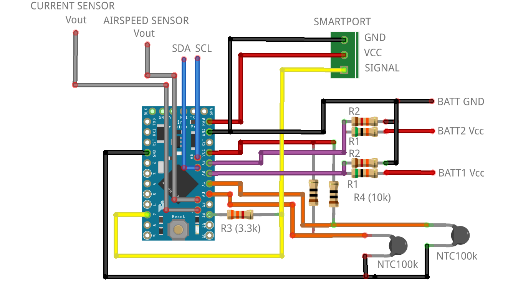 
  <i>I2C and analog sensors with Smartport</i>  

## 4. Flash to Arduino

Using Arduino IDE copy folder *msrc* and open *msrc.ino*. Select the board and flash

## 5. Configuration

### Smartport

The configuration is modified with a lua script (X7, X9, X-lite and Horus with openTx 2.2 or higher)

      

Copy the file msrc.lua to the SCRIPTS/TOOLS folder. (if using older openTx 2.2 copy to SCRIPTS folder and execute by long press)

If not using lua script comment *#define CONFIG_LUA* and assign config values in msrc.h

Options:

- ESC protocol. HobbyWing Platinum V3, HobbyWing Platinum V4/Hobbywing Flyfun V5 or PWM signal
- Voltage1. Enable/disable analog voltage divider 1
- Voltage2. Enable/disable analog voltage divider 2
- Ntc1. Enable/disable analog thermistor 1
- Ntc2. Enable/disable analog thermistor 2
- Current. Enable/disable analog current
- Airspeed. Enable/disable analog airspeed sensor
- PWM out. Enable/disable analog a PWM signal from RPM values from ESC serial
- GPS.  Enable/disable serial GPS
- Averaging queue size: 1 to 16
- Refresh rate (ms): 0 to 1600
- I2C (x2). Sensor type and address

### Other RX protocols

Configuration is done in *config.h*

## 6. OpenTx sensors (Smartport)

The default sensor id is 10. This can be changed with [change_id_frsky](https://github.com/dgatf/change_id_frsky)

Depending on your configuration some the following sensors will be available in Opentx. After configuration go to sensors screen and update with *Search new sensors*
 
ESC:

- ESC RPM: Erpm (0x0b60)
- ESC voltage: EscV (0x0b50)
- ESC cell average: VFAS (0x0210)
- ESC current: EscA (0x0b50)
- ESC temp FET (HW) or ESC temp linear (Castle): EscT (0x0b70)
- ESC temp BEC (HW) or ESC temp NTC (Castle): EscT (0x0b71)
- ESC ripple voltage: EscV (0x0b51)
- ESC BEC voltage: BecV (0x0e50)
- ESC BEC current: BecC (0x0e50)

GPS:

- GPS Lat/Lon: GPS (0x800)
- GPS altitude: GAlt (0x820)
- GPS speed: GSpd (0x820)
- GPS compass: Hdg (0x840)
- GPS date/time: Date (0x850)

Analog:

- Voltage 1: A3 (0x0900)
- Voltage 2: A4 (0x0910)
- Thermistor 1: Tmp1 (0x0400)
- Thermistor 2: Tmp2 (0x0410)
- Current: Curr (0x020f)
- AirSpeed: ASpd (0x0a00)

I2C:

 - Altitude: Alt (0x0820)
 - Temperature: T1 (0x0401, 0x0402)

Some of the sensors have to be adusted in openTx

### 6.1. Adjust RPM sensor (Erpm)

- Blades/poles: number of pair of poles * main gear teeth  
- Multiplier: pinion gear teeth

### 6.2. Adjust voltage sensors (A3, A4)

Measure the voltage of the battery with a voltmeter and adjust *Ratio* in A3, A4 sensor

### 6.3. Adjust analog current sensor (Curr)

If using a hall effect sensor, adjust the ratio: *25.5 x 1000 / output sensitivity (mV/A)*

To calculate the battery consumption add a new sensor:

- Type: Calculated
- Formula: Consumption
- Sensor: Curr

### 6.4 Calibrate current sensor HW V4/V5 (EscA)

HW V4/V5 uses few different offsets to measure the current. It have been detected two types, V4 and V5, but there seems to be more types

Current value should be close to 0 A without blades and throttle at 50%. If this is not the case you can calibrate the current sensor (EscA) in opentx (sensor->edit sensor->offset) by adjusting the offset with the value at this condition (no blades and 50% throttle)

## 7. Images

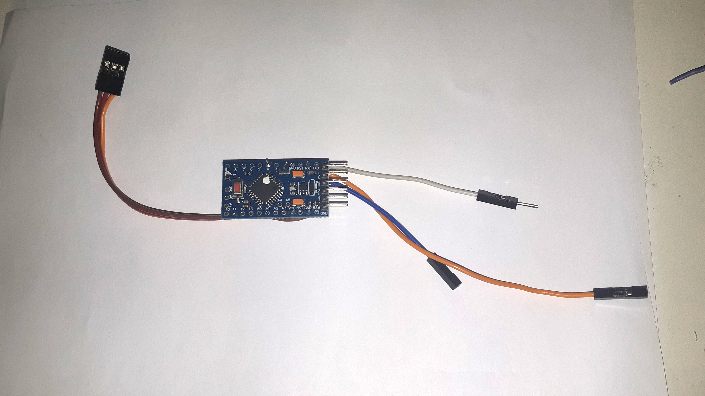  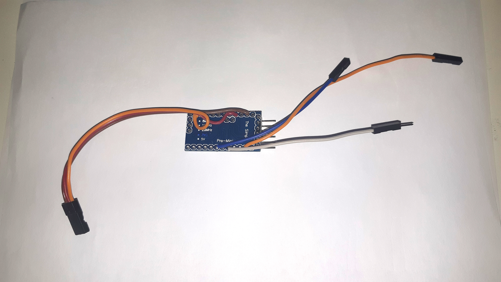

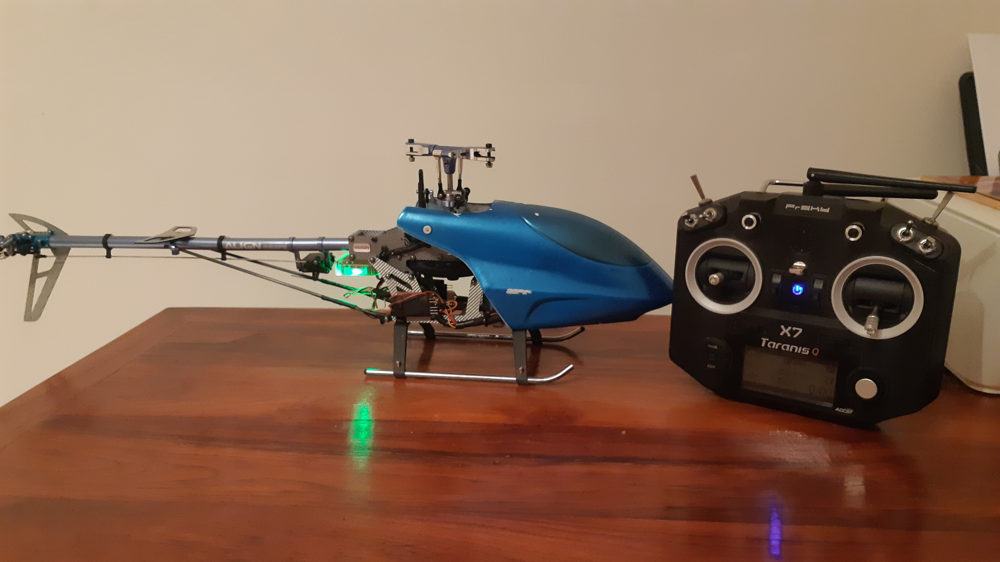  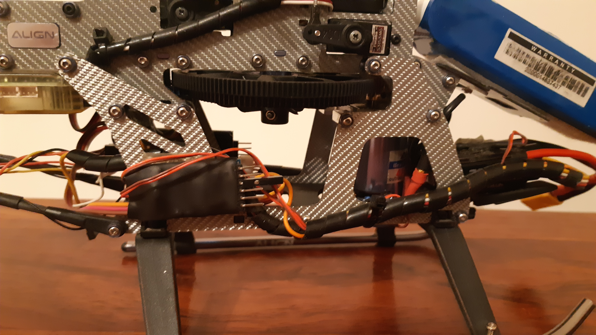

  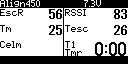 <i>MSRC on Align 450 connected to Hobbywing V3 Platinum and two thermistors for ESC and motor</i> 

## 8. Video

[Video](https://youtu.be/Mby2rlmAMlU)

## 9. Annex

### 9.1. ESC protocol specifications Hobbywing

Serial parameters:

- 19200 bps
- 1 packet every 20 ms
- Big endian

#### Hobbywing V3

| Byte  | 1                   | 2                | 3                | 4                | 5             | 6              | 7            | 8            | 9           | 10          |
| ----- | :-----------------: | :--------------: | :--------------: | :--------------: | :-----------: | :------------: | :----------: | :----------: | :---------: | :---------: |
| Value | Package Head (0x9B) | Package Number 1 | Package Number 2 | Package Number 3 | Rx Throttle 1 | Rx Throttle  2 | Output PWM 1 | Output PWM 2 | RPM Cycle 1 | RPM Cycle 2 |

*RPM = 60000000 / RPM Cycle*

thr, pwm: 0-255 (8bits)

#### Hobbywing V4 V5

| Byte  | 1     | 2     | 3     | 4     | 5     | 6     | 7     | 8     | 9     | 10    | 11    | 12    | 13    | 14    | 15    | 16    | 17    | 18    | 19    |
| ---   | :---: | :---: | :---: | :---: | :---: | :---: | :---: | :---: | :---: | :---: | :---: | :---: | :---: | :---: | :---: | :---: | :---: | :---: | :---: |
| Value | Package Head (0x9B) | Package Number 1 |	Package Number 2 | Package Number 3	| Rx Throttle 1	| Rx Throttle  2 | Output PWM 1 | Output PWM 2	| RPM 1 | RPM 2	| RPM 3	| Voltage 1 |	Voltage 2	| Current 1	| Current 2	| TempFET 1	| TempFET 2	| Temp 1 |	Temp 2

thr, pwm: 0-1024 (10bits)

Voltage, current and temperature are raw sensor data. Actual values requires transformation. Depending on the model, sensors are different so  the transformations:

  - Voltage divider. Different for LV and HV models. LV divisor 11. HV divisor 21
  - Current sensor (shunt resistor and diff amp). Different for V4 and V5. V5 seems to be shifted by Vref=0.53V. See 4.4 Calibrate current sensor HW V4/V5
  - Temperature. NTC resistor. So far it is the same for tested models

Before throttle is raised from 0, signature packets are sent between telemetry packets. This is used to identify the hardware and firmware of the ESC

Examples:

| Model\Byte    | 1     | 2     | 3     | 4     | 5     | 6     | 7     | 8     | 9     | 10    | 11    | 12    | 13    |
| ----------    | :---: | :---: | :---: | :---: | :---: | :---: | :---: | :---: | :---: | :---: | :---: | :---: | :---: |
| V4LV25/60/80A | 0x9B  | 0x9B  | 0x03  | 0xE8  | 0x01  | 0x08  | 0x5B  | 0x00  | 0x01  | 0x00  | 0x21  | 0x21  | 0xB9  |
| V4HV200A OPTO | 0x9B  | 0x9B  | 0x03  | 0xE8  | 0x01  | 0x02  | 0x0D  | 0x0A  | 0x3D  | 0x05  | 0x1E  | 0x21  | 0xB9  |
| V5HV130A OPTO | 0x9B  | 0x9B  | 0x03  | 0xE8  | 0x01  | 0x0B  | 0x41  | 0x21  | 0x44  | 0xB9  | 0x21  | 0x21  | 0xB9  |

### 9.2. ESC protocol specifications Castle Link

For best accuracy RX pulse input is captured with a timer interrupt and ESC pulse output is produced by hardware PWM. Maximum latency is 20ms

See [Castle Link Live](https://dzf8vqv24eqhg.cloudfront.net/userfiles/4671/6540/ckfinder/files/Product%20Manuals/Accessories%20and%20replacement%20parts/castle_link_live_2_0.pdf?dc=201606221536-537)

### 9.3. Output PWM signal for FBL

For best accuracy PWM signal output for FBL is produced by hardware PWM from serial RPM values. Maximum latency is 40ms

### 9.4. ADC voltage

To obtain the voltage at the analog pin it is required the ADC bits (b) and the Vref:

 

### 9.5. Analog voltage sensors. Voltage divider circuit

Two battery voltages can be measured through the analog pins A2 and A3
Metal resistors are recommended as gives more accurate readings (0.1W or higher)
Arduino can read up to 3.3V/5V and is optimized for signal inputs with 10K impedance

To select R values apply formulas:

 

For 6S battery (or lower) and Pro Mini 3.3v:

 - R1 68k
 - R2 10k

If more than 6S change R values or you may burn the Arduino!

### 9.6. Temperature sensors. Thermistors

Two temperature sensors can be installed through the analog pins A0 and A1
Temperature is measured with NTC thermistors (100k). Adjust thermistor Beta in ntc.h if needed (NTC_BETA, default is 4190). Sensor output in Celsius

To obtain the thermistor resistance:

And temperature with Beta formula:

Or with Steinhart and Hart Equation if data is available:

### 9.7. Current

#### Hall effect

Hall effect sensors. Induced magnetic field is transformed into voltage. They are caracterized by their sensitivity

#### Shunt resistor

The voltage drop in the shunt resistor is amplified by a differential amplifier to obtain Vo

### 9.8. Air Speed

Air speed is measured with a differential pressure sensor 

Presssure is calculated with the sensor's transfer formula:

And the air speed using the Bernouilli formula:

After 2 seconds the sensor is calibrated to zero

Adjust constants in *pressure.h*:

- TRANSFER_SLOPE (B) as per sensor datasheet
- For fine tuning measure the Vcc on the sensor and adjust TRANSFER_VCC

## 10. Change log

0.8

- Added Rx protocols Frsky D, Spektrum XBUS, Spektrum SRXL V5, Flysky Ibus
- Added support for ATmega328PB, ATmega2560, ATmega32U4, ARM Cortex M0+ and ARM Cortex M4
- Improved accuracy for PWM input (rpm) measurement
- Added support for Kontronik ESC

[v0.7](https://github.com/dgatf/msrc/tree/v0.7)

- Added analog airspeed sensor (MPXV7002)
- Fixed Castle Link bug
- Removed BMP180
- Fixed flickering in color lcd displays

[v0.6](https://github.com/dgatf/msrc/tree/v0.6)

- Added GPS serial (BN220, BN880, NEO-M8N,...)

[v0.5](https://github.com/dgatf/msrc/tree/v0.5)

- Added Castle Link Live protocol
- Hobbywing V4/V5. Improved transformations for voltage and current depending on the model (thanks to Commodore8888)

[v0.4.1](https://github.com/dgatf/msrc/tree/v0.4.1)

- Fix Horus display

[v0.4](https://github.com/dgatf/msrc/tree/v0.4)

- Changed R3 resistor to 3.3k
- Support for [change_id_frsky](https://github.com/dgatf/change_id_frsky) to change the sensor id
- Support for I2C sensors 
- Improved code quality and performance
- [Smartport_library](https://github.com/dgatf/smartport) improved performance and abstract from the smartport protocol

[v0.3.1](https://github.com/dgatf/msrc/tree/v0.3.1)

- Added cell voltage average (HW V4/V5, VFAS sensor)
- Applied correct transformation for esc voltage, current and temperature (HW V4/V5)
- Changed averaging type from SMA to EMA
- Added esc protocol NONE
- Smartport protocol. Minor improvements

[v0.3](https://github.com/dgatf/msrc/tree/v0.3)

- Esc current sensor (EscA) added (HW V4/V5, 80A or higher)
- Averaging telemetry added
- Voltage2 sensor changed from A3 to A4
- Ntc2 sensor changed from Tmp1 to Tmp2
- Averaging governor added
- Refresh rate and averaging added to lua config script

## 9. Support

For questions, issues or new protocol request (use this [sketch](./sniffer/sniffer.ino)) please post in the forums:

[Helifreak](https://www.helifreak.com/showthread.php?t=835243)

[Openrcforums](https://www.openrcforums.com/forum/viewtopic.php?f=84&t=11911)

Or open an [Issue](https://github.com/dgatf/msrc/issues) in Github

## 10. Acknowledgements

- Commodore8888 (Helifreak)
- MikeJ (Helifreak)