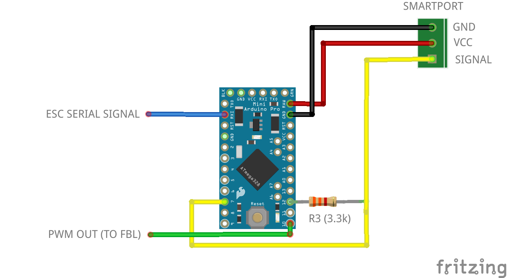
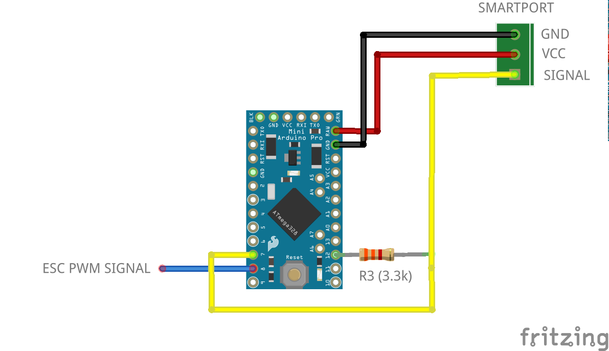
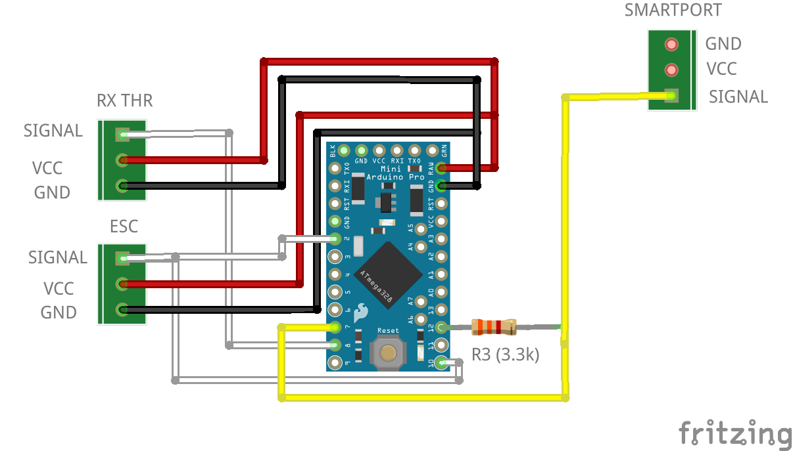
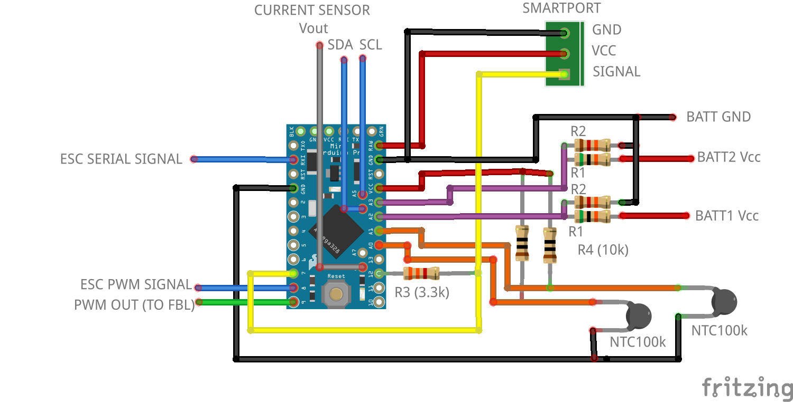

# MSRC - Multi Sensor for RC - FrSky Smartport

This is a DIY project to send multiple sensors telemetry to Frsky Smartport using an Arduino Pro Mini 328P (3.3v or 5v)

The following sensors are supported:

- ESC
  - ESCs with serial telemetry (Hobbywing V3/V4/V5)
  - ESC with PWM signal or phase sensor
  - ESC Castle Link
- GPS serial (NMEA)
- I2C sensors
- Analog sensors

All sensors are optional. Make the circuit with the desired sensors and enable them through the configuration with a lua script

## 1. Sensors

### 1.1. ESC

#### Serial telemetry

If the ESC have a serial port for telemetry output it can be decoded connecting the ESC to the available UART in the Pro Mini. Serial protocols implemented:

- Hobbywing Platinum V3: RPM
- Hobbywing Platinum V4, Hobbywing Flyfun V5: RPM, temperature (Mosfet and BEC), voltage and current

Optionally a PWM signal (PIN 10, 3.3V, 50% duty) can be generated from the RPM value in serial telemetry

 
  <i>ESC serial circuit</i>  

#### PWM signal

If the ESC have a PWM signal for motor RPMs or a phase sensor is installed, the RPMs can be measured with the 16bit timer of the Pro Mini. If ESC have both serial and PWM signal, like Hobbywing V4/V5, then PWM signal is not needed for telemetry

 
  <i>PWM signal/phase sensor circuit</i>  

#### Castle link

ESC Castle Link protocol is also implemented. The telemetry values goes together with the PWM input signal to the ESC. This is an inverted PWM signal and the ESC option *Castle Link* has to be enabled

 
  <i>Minimum circuit Castle Link</i>  

#### Available ESC telemetry

| Model              | RPM         | Throttle    | Motor PWM   | Voltage     | Current   | Voltage BEC | Current BEC | Temperature 1 | Temperature 2 | Ripple Volt |
| ------------------ | :---------: | :---------: | :---------: | :---------: | :-------: | :---------: | :---------: | :-----------: | :-----------: | :---------: |
| Hobbywing V3       | :white_check_mark:         | :white_check_mark:(1)      | :white_check_mark:(1)      |             |           |             |             |               |               |             |
| Hobbywing V4/V5(4) | :white_check_mark:         | :white_check_mark:(1)      | :white_check_mark:(1)      | :white_check_mark:         | :white_check_mark:(2)    |             |             | :white_check_mark: FET       | :white_check_mark: BEC       |             |
| Castle Link        | :white_check_mark:         | :white_check_mark:(1)      | :white_check_mark:(1)      | :white_check_mark:         | :white_check_mark:       | :white_check_mark:(3)      | :white_check_mark:(3)      | :white_check_mark:           |               | :white_check_mark:         |

(1) Available but not forwarded to smartport  
(2) For 80A models and higher  
(3) Not available in all models  
(4) Sensors varies depending on model and firmware. Update ESC to the latest firmware available. See [annex](#Hobbywing-V4-V5)

If voltage is available the cell voltage average is calculated for 3S,4S,5S,6S,7S,8S,10S and 12S batteries. 10 seconds after power on the number of cells is autodetected. Average cell voltage to be >3.8v for correct cell count

### 1.2. Serial GPS

Serial GPS (NMEA protocol) is supported although is not feasible to connect at the same time with a serial ESC as there is only one UART available. The connections are the same as for the ESC serial

### 1.3. Analog sensors

The following analog sensors are supported:

- 2 x voltage divider (A2, A3)
- 2 x temperature sensors (thermistors) (A0, A1)
- Current sensor (Hall effect) (A6)
- Airspeed sensor (MPXV7002) (A7)

### 1.4. I2C sensors

The following I2C sensors are suported (pins A4, A5):

- Barometer: BMP180, BMP280

 
  <i>I2C and analog sensors</i>  

## 2. Flash to Arduino

Using Arduino IDE copy folder *msrc* and open *msrc.ino*. Select board *Arduino Pro or Pro Mini*, processor *ATMega328P (3.3V 8MHz or 5V 16MHz)* and flash

## 3. Configuration

The configuration is modified with a lua script (X7, X9, X-lite and Horus with openTx 2.2 or higher)

      

Copy the file msrc.lua to the SCRIPTS/TOOLS folder. (if using older openTx 2.2 copy to SCRIPTS folder and execute by long press)

If not using lua script comment *#define CONFIG_LUA* and assign config values in msrc.h

Options:

- ESC protocol. HobbyWing Platinum V3, HobbyWing Platinum V4/Hobbywing Flyfun V5 or PWM signal
- Voltage1. Enable/disable analog voltage divider 1
- Voltage2. Enable/disable analog voltage divider 2
- Ntc1. Enable/disable analog thermistor 1
- Ntc2. Enable/disable analog thermistor 2
- Current. Enable/disable analog current
- Airspeed. Enable/disable analog airspeed sensor
- PWM out. Enable/disable analog a PWM signal from RPM values from ESC serial
- GPS.  Enable/disable serial GPS
- Averaging queue size: 1 to 16
- Refresh rate (ms): 0 to 1600
- I2C (x2). Sensor type and address

## 4. OpenTx sensors

The default sensor id is 10. This can be changed with [change_id_frsky](https://github.com/dgatf/change_id_frsky)

Depending on your configuration some the following sensors will be available in Opentx. After configuration go to sensors screen and update with *Search new sensors*
 
ESC:

- ESC RPM: Erpm (0x0b60)
- ESC voltage: EscV (0x0b50)
- ESC cell average: VFAS (0x0210)
- ESC current: EscA (0x0b50)
- ESC temp FET (HW) or ESC temp linear (Castle): EscT (0x0b70)
- ESC temp BEC (HW) or ESC temp NTC (Castle): EscT (0x0b71)
- ESC ripple voltage: EscV (0x0b51)
- ESC BEC voltage: EscV (0x0e50)

GPS:

- GPS Lat/Lon: GPS (0x800)
- GPS altitude: GAlt (0x820)
- GPS speed: GSpd (0x820)
- GPS compass: Hdg (0x840)
- GPS date/time: Date (0x850)

Analog:

- Voltage 1: A3 (0x0900)
- Voltage 2: A4 (0x0910)
- Thermistor 1: Tmp1 (0x0400)
- Thermistor 2: Tmp2 (0x0410)
- Current: Curr (0x020f)
- AirSpeed: ASpd (0x0a00)

I2C:

 - Altitude: Alt (0x0820)
 - Temperature: T1 (0x0401, 0x0402)

Some of the sensors have to be adusted in openTx

### 4.1. Adjust RPM sensor (Erpm)

- Blades/poles: number of pair of poles * main gear teeth  
- Multiplier: pinion gear teeth

### 4.2. Adjust voltage sensors (A3, A4)

Measure the voltage of the battery with a voltmeter and adjust *Ratio* in A3, A4 sensor

### 4.3. Adjust current sensor (Curr)

If using a hall effect sensor, adjust the ratio: *1000 / output sensitivity (mV/A)*

To calculate the battery consumption add a new sensor:

- Type: Calculated
- Formula: Consumption
- Sensor: Curr

## 5. Images

  

  

   <i>MSRC on Align 450 connected to Hobbywing V3 Platinum and two thermistors for ESC and motor</i> 

## 6. Video

[Video](https://youtu.be/Mby2rlmAMlU)

## 7. Annex

### 7.1. ESC protocol specifications Hobbywing

Serial parameters:

- 19200 bps
- 1 packet every 20 ms
- Big endian

#### Hobbywing V3

| Byte  | 1                   | 2                | 3                | 4                | 5             | 6              | 7            | 8            | 9           | 10          |
| ----- | :-----------------: | :--------------: | :--------------: | :--------------: | :-----------: | :------------: | :----------: | :----------: | :---------: | :---------: |
| Value | Package Head (0x9B) | Package Number 1 | Package Number 2 | Package Number 3 | Rx Throttle 1 | Rx Throttle  2 | Output PWM 1 | Output PWM 2 | RPM Cycle 1 | RPM Cycle 2 |

*RPM = 60000000 / RPM Cycle*

rpm, pwm: 0-255 (8bits)

#### Hobbywing V4 V5

| Byte  | 1     | 2     | 3     | 4     | 5     | 6     | 7     | 8     | 9     | 10    | 11    | 12    | 13    | 14    | 15    | 16    | 17    | 18    | 19    |
| ---   | :---: | :---: | :---: | :---: | :---: | :---: | :---: | :---: | :---: | :---: | :---: | :---: | :---: | :---: | :---: | :---: | :---: | :---: | :---: |
| Value | Package Head (0x9B) | Package Number 1 |	Package Number 2 | Package Number 3	| Rx Throttle 1	| Rx Throttle  2 | Output PWM 1 | Output PWM 2	| RPM 1 | RPM 2	| RPM 3	| Voltage 1 |	Voltage 2	| Current 1	| Current 2	| TempFET 1	| TempFET 2	| Temp 1 |	Temp 2

rpm, pwm: 0-1024 (10bits)

Voltage, current and temperature are raw sensor data. Actual values requires transformation. Depending on the model, sensors are different so  the transformations:

  - Voltage divider. Different for LV and HV models. LV divisor 11. HV divisor 21
  - Current sensor (shunt resistor and diff amp). Different for V4 and V5. V5 seems to be shifted by Vref=0.53V
  - Temperature. NTC resistor. So far it is the same for tested models

Before throttle is raised from 0, signature packets are sent between telemetry packets. This is used to identify the hardware and firmware of the ESC

Examples:

| Model\Byte | 1     | 2     | 3     | 4     | 5     | 6     | 7     | 8     | 9     | 10    | 11    | 12    | 13    |
| ---------- | :---: | :---: | :---: | :---: | :---: | :---: | :---: | :---: | :---: | :---: | :---: | :---: | :---: |
| V4LV80A    | 0x9B  | 0x9B  | 0x03  | 0xE8  | 0x01  | 0x08  | 0x5B  | 0x00  | 0x01  | 0x00  | 0x21  | 0x21  | 0xB9  |
| V5HV130A   | 0x9B  | 0x9B  | 0x03  | 0xE8  | 0x01  | 0x0B  | 0x41  | 0x21  | 0x44  | 0xB9  | 0x21  | 0x21  | 0xB9  |

### 7.2. ESC protocol specifications Castle Link

For best accuracy RX pulse input is captured with a timer interrupt and ESC pulse output is produced by hardware PWM. Maximum latency is 20ms

See [Castle Link Live](https://dzf8vqv24eqhg.cloudfront.net/userfiles/4671/6540/ckfinder/files/Product%20Manuals/Accessories%20and%20replacement%20parts/castle_link_live_2_0.pdf?dc=201606221536-537)

### 7.3. Output PWM signal for FBL

For best accuracy PWM signal output for FBL is produced by hardware PWM from serial RPM values. Maximum latency is 40ms

### 7.4. ADC voltage

To obtain the voltage at the analog pin it is required the ADC bits (b) and the Vref:

 

### 7.5. Analog voltage sensors. Voltage divider circuit

Two battery voltages can be measured through the analog pins A2 and A3
Metal resistors are recommended as gives more accurate readings (0.1W or higher)
Arduino can read up to 3.3V/5V and is optimized for signal inputs with 10K impedance

To select R values apply formulas:

 

For 6S battery (or lower) and Pro Mini 3.3v:

 - R1 68k
 - R2 10k

If more than 6S change R values or you may burn the Arduino!

### 7.6. Temperature sensors. Thermistors

Two temperature sensors can be installed through the analog pins A0 and A1
Temperature is measured with NTC thermistors (100k). Adjust thermistor Beta in ntc.h if needed (NTC_BETA, default is 4190). Sensor output in Celsius

To obtain the thermistor resistance:

And temperature with Beta formula:

Or with Steinhart and Hart Equation if data is available:

### 7.7. Current

#### Hall effect

Hall effect sensors. Induced magnetic field is transformed into voltage. They are caracterized by their sensitivity

#### Shunt resistor

The voltage drop in the shunt resistor is amplified by a differential amplifier to obtain Vo

### 7.8. Air Speed

Air speed is measured with a differential pressure sensor 

Presssure is calculated with the sensor's transfer formula:

And the air speed using the Bernouilli formula:

After 2 seconds the sensor is calibrated to zero

Adjust constants in *pressure.h*:

- TRANSFER_SLOPE as per sensor datasheet
- For fine tuning measure the Vcc on the sensor and adjust TRANSFER_VCC

## 8. Change log

v0.7

- Added analog airspeed sensor (MPXV7002)

[v0.6](https://github.com/dgatf/msrc/tree/v0.5)

- Added GPS serial (BN220, BN880, NEO-M8N,...)

[v0.5](https://github.com/dgatf/msrc/tree/v0.5)

- Added Castle Link Live protocol
- Hobbywing V4/V5. Improved transformations for voltage and current depending on the model (thanks to Commodore8888)

[v0.4.1](https://github.com/dgatf/msrc/tree/v0.4.1)

- Fix Horus display

[v0.4](https://github.com/dgatf/msrc/tree/v0.4)

- Changed R3 resistor to 3.3k
- Support for [change_id_frsky](https://github.com/dgatf/change_id_frsky) to change the sensor id
- Support for I2C sensors 
- Improved code quality and performance
- [Smartport_library](https://github.com/dgatf/smartport) improved performance and abstract from the smartport protocol

[v0.3.1](https://github.com/dgatf/msrc/tree/v0.3.1)

- Added cell voltage average (HW V4/V5, VFAS sensor)
- Applied correct transformation for esc voltage, current and temperature (HW V4/V5)
- Changed averaging type from SMA to EMA
- Added esc protocol NONE
- Smartport protocol. Minor improvements

[v0.3](https://github.com/dgatf/msrc/tree/v0.3)

- Esc current sensor (EscA) added (HW V4/V5, 80A or higher)
- Averaging telemetry added
- Voltage2 sensor changed from A3 to A4
- Ntc2 sensor changed from Tmp1 to Tmp2
- Averaging governor added
- Refresh rate and averaging added to lua config script

## 9. Support

For questions, issues or new protocol request (use this [sketch](./sniffer/sniffer.ino)) please post in the forums:

[Helifreak](https://www.helifreak.com/showthread.php?t=835243)

[Openrcforums](https://www.openrcforums.com/forum/viewtopic.php?f=84&t=11911)

Or open an [Issue](https://github.com/dgatf/msrc/issues) in Github

## 10. Acknowledgements

- Commodore8888 (Helifreak)
- MikeJ (Helifreak)