# Remark: This is the new version for the RP2040 board #

For previous versions see branch [legacy_arduino](https://github.com/dgatf/msrc/tree/legacy_arduino)

- More powerful board for less price: Cortex M0+ 32bits, 133MHz, 2MB flash, 256kB RAM, 3xUARTS, 2xI2C, PIO
- Same board for all configurations
- Easier to upload firmware: drag and drop
- Config through USB
- Rewritten in C with FreeRTOS (Not C++ and Arduino framework)
- No bit bang libraries like softserial

# MSRC - Multi Sensor for RC - RP2040 - Smartport, Frsky D, XBUS, SRXL, IBUS, SBUS2, Multiplex Sensor Bus, Jeti Ex Bus, Hitec

This is a DIY project to send sensors telemetry for a fraction of the weight and cost of the stock sensors. It adds support for several ESC telemetry protocols.

Compatible RX protocols: Frsky Smartport, FrSky D, Spektrum XBUS, Spektrum SRXL V5, Flysky IBUS, Futaba SBUS2, Multiplex Sensor Bus, Jeti Ex Bus.

Compatible ESCs: Hobbywing V3/V4/V5, Kontronik Kosmic/Kolibri/JivePro, Castle Link, APD F/HV/UHV, phase sensor/PWM signal.

Compatible MCUs: RP2040. Any model is compatible. Recommended [RP2040 Zero](https://www.mischianti.org/wp-content/uploads/2022/09/Waveshare-rp2040-zero-Raspberry-Pi-Pico-alternative-pinout.jpg), for size and GPIO selection.

Implemented sensors:

- ESC
  - ESCs with serial telemetry (Hobbywing V3/V4/V5(1), Kontronik(2)), APD F/HV/UHV
  - ESC with PWM signal or phase sensor
  - ESC Castle Link
- GPS serial (NMEA)
- I2C sensors: BMP180, BMP280, MS5611
- Analog sensors: voltage, temperature, current, air speed

All sensors are optional. Make the circuit with the desired sensors and enable them in the configuration. It can be configured from the PC with msrc_gui.

(1) HW V5 = HW FlyFun. If ESC doesn't arm, enable _ESC Init Delay_ or connect MSRC after the ESC is armed  
(2) Supported: Kosmic, Kolibri, JivePro. Not supported: Jive.

## 1. Connections

Connections to RP2040 in the table bellow are GPIO numbers, which are the same for all RP2040 boards. Pin numbers are different depending on the board.

| Sensor/Receiver                           | Board GPIO|
| :---:                                     | :---:            |
| Smartport, SBUS, SRXL, IBUS, SB, Jeti Ex  | 0(1) & 1 |
| Frsky D                                   | 0                |
| Hitec, XBUS SDA                           | 2(2)  |
| Hitec, XBUS SCL                           | 3(2)  |
| ESC serial                                | 5                |
| Phase sensor (PWM in)                     | 5                |
| Castle. Receiver signal                   | 4                |
| Castle. ESC signal                        | 5(2)  |
| GPS                                       | 6                |
| XBUS. NPN clock stretch(3)     | 7                |
| Sensor SDA                                | 8(2)  |
| Sensor SCL                                | 9(2)  |
| PWM out                                   | 10               |
| Voltage                                   | 26               |
| Current                                   | 27               |
| NTC                                       | 28               |
| Airspeed                                  | 29               |

(1) with 1k resistor  
(2) with 1k-3.3k pull up resistor  
(3) Optional  

Status led of the board blinks when sending telemetry. If it doesn't blink check connections and config

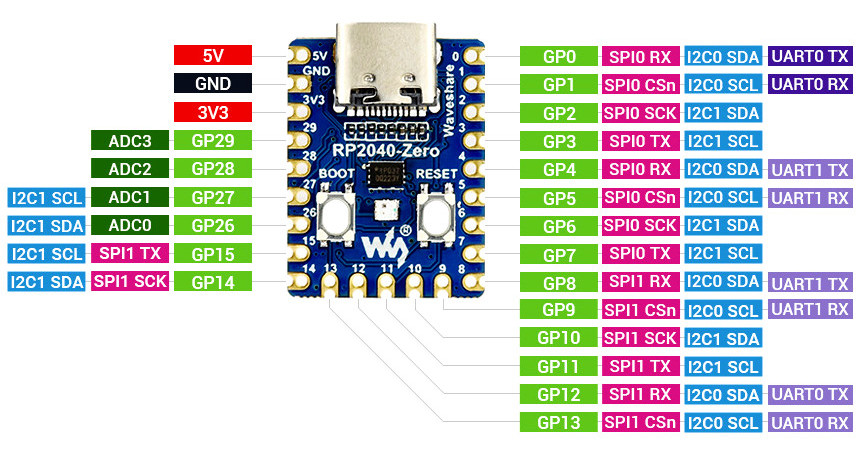 
  <i>RP2040 Zero pinout</i>  

## 2. Power source

All receivers provide 3.3V at the telemetry port. Connect Vcc at telemetry port to RP2040 V5/VSYS pin. Alternatively you can feed the RP2040 from the BEC or receiver if the voltage is less than 5.5V

## 3. Flash firmware to RP2040

Press BOOT button during startup and paste the binary file [MSRC-RP2040.uf2](binaries/MSRC-RP2040.uf2) to RP2040 folder

If you want to build the firmware for the RP2040 yourself:

- Install [RP2040 SDK](https://github.com/raspberrypi/pico-sdk)
- Clone this repo with *git clone --recurse-submodules https://github.com/dgatf/msrc.git* as this repo contains submodules.
- _cd board_
- _mkdir build_
- _cd build_
- _cmake .._
- _make_
- File to flash: _project/MSRC-RP2040.uf2_

## 4. Configuration

### 4.1. From PC - MSRC gui

Connect RP2040 to USB and update config with msrc_gui. [msrc_gui.AppImage](binaries/msrc_gui.AppImage) for Linux and [msrc_gui.exe](binaries/msrc_gui.exe) for windows. After update reboot RP2040 manually.

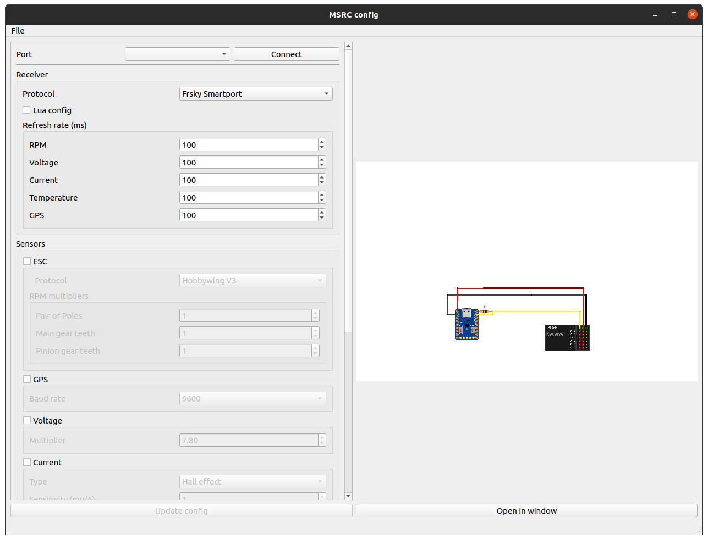 

Debug mode can be enabled and viewed with msrc_gui.

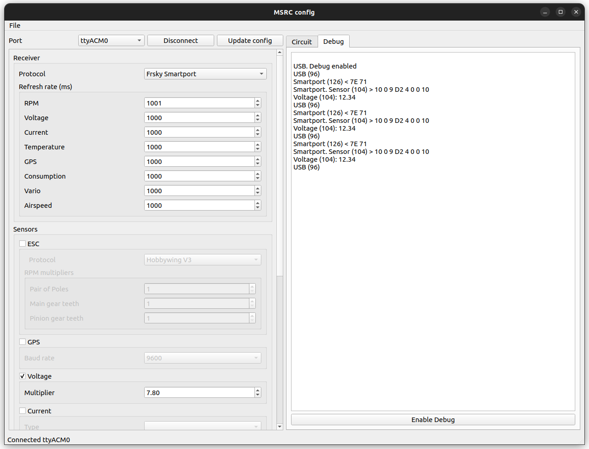 

If you want to build msrc_gui:

- Install [QT](https://www.qt.io/)
- Install Qt serial port library (Use _Maintenance Tool_ or in Ubuntu *sudo apt install libqt5serialport5-dev*)
- _cd msrc_gui_
- _mkdir build_
- _cd build_
- _qmake .._
- _make_

### 4.2. From transmitter using lua script (only Smartport)

It is recommended to update config with *msrc_gui* as not all parameters are implemented in lua script.

The configuration is modified with a lua script (X7, X9, X-lite and Horus with openTx 2.2 or higher)

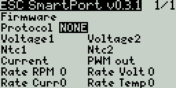   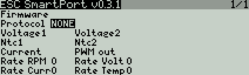   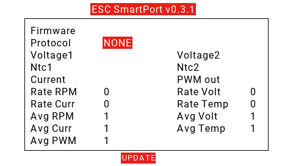

Copy the file msrc.lua to the SCRIPTS/TOOLS folder. (if using older openTx 2.2 copy to SCRIPTS folder and execute by long press)

Options:

- ESC protocol. HobbyWing Platinum V3, HobbyWing Platinum V4/Hobbywing Flyfun V5 or PWM signal
- Voltage. Enable/disable analog voltage divider 1
- Ntc. Enable/disable analog thermistor 1
- Current. Enable/disable analog current
- Airspeed. Enable/disable analog airspeed sensor
- PWM out. Enable/disable analog a PWM signal from RPM values from ESC serial
- GPS.  Enable/disable serial GPS
- Averaging queue size: 1 to 16
- Refresh rate (ms): 0 to 1600
- I2C. Sensor type and address

## 5. Receiver protocol

The following Rx protocols are supported:

- Frsky Smartport: inverted serial, 57600 bps
- Frsky D: inverted serial, 9200 bps
- Spektrum SRXL V5: serial, 115200 bps
- Spektrum XBUS: I2C
- Flysky IBUS: serial, 115200 bps
- Futaba SBUS2: inverted serial, 100000 bps
- Multiplex Sensor Bus: serial, 38400 bps
- Jeti Ex Bus: serial 125000, 250000 bps
- Hitec: I2C

### XBUS

Auto-config may be used to detect the new sensors.

If no telemetry is shown, may be MSRC is booting too slow and the first poll from the receiver is not answered. There are several ways to fix this:

1. Power on the receiver after MSRC has started
3. I2C clock stretch. Pull down the SCL line until MSRC has started, then open the switch. You can use a manual switch or a NPN transistor (e.g. PN2222ABU). If using a transistor you need to enable _XBUS Clock Stretch_ to open the transistor switch after boot. If using manual switch, open the switch after boot, to finish the clock stretch

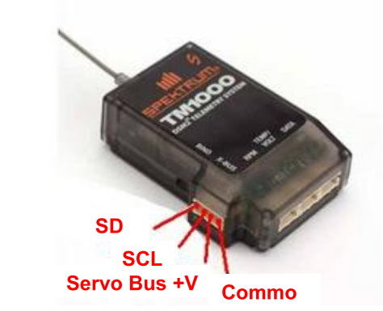 
  <i>XBUS port</i>  

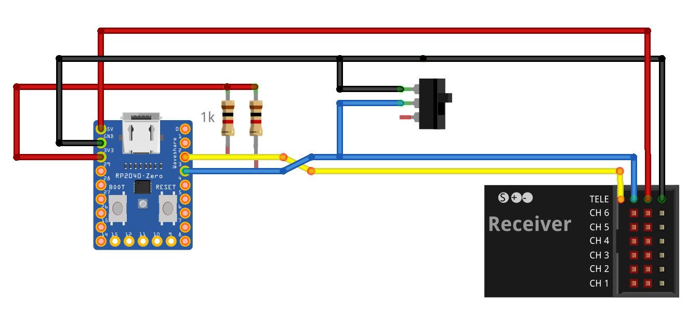 
  <i>Clock stretch XBUS with manual switch</i>  

### SBUS 2

Slots sensor mapping for Futaba transmitters:

| Slot   | Sensor                               |
| :----: | :----------------------------------: |
|0       | RX voltage (reserved)                |
|1       | Temperature 1 (SBS-01T/TE)           |
|2       | RPM (type magnet)(SBS-01RB/RM/RO)    |
|3-4     | Vario-F1672                          |
|6-7     | Voltage (SBS-01V)                    |
|8-15    | GPS-F1675 (2)                         |
|16      | Air speed (SBS-01TAS)                |
|17-23   | Unused                               |
|24-26   | Current 1 (SBS-01C)                  |
|27-29(2)| Current 2 (SBS-01C)                  |
|30(2)   | Temperature 2 (SBS-01T/TE)           |
|31      | Unused                               |

(1) Do not select default GPS  
(2) Non default slots

Select protocol: FASSTest 18CH or T-FHSS

Connect to SBUS2 port

### Multiplex M-Link

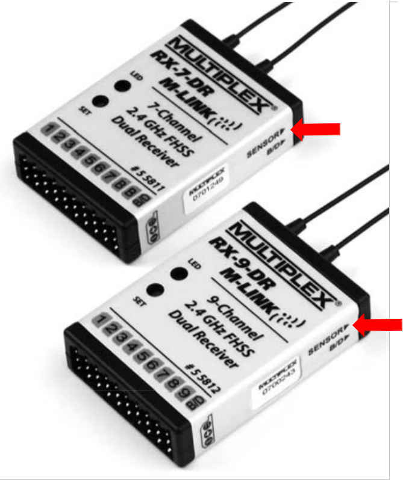 
  <i>M-Link port</i>  

### Jeti Ex Bus

Configure receiver pin (E1 or E2) as Ex Bus

### Hitec

If Vin is a regulated 5V source (e.g. receiver, BEC), pull ups can be connected to Vin/RAW instead Vcc. Use pull ups resistors 1k to 2.7k

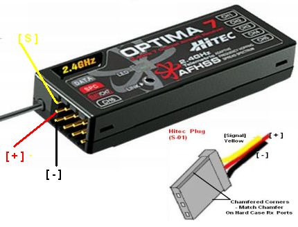 
  <i>Hitec Optima 7</i>  

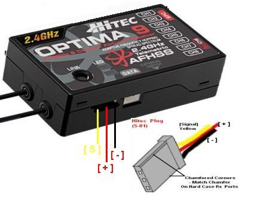 
  <i>Hitec Optima 9</i>  

## 6. Sensors

### 6.1. ESC

#### 6.1.1. Serial telemetry

Compatible ESC serial protocols:

 - Hobbywing V3/V4/V5. Serial 19200
 - Kontronik Kosmic/Kolibri/JivePro. Serial 115200, even parity
 - APD F/HV/UHV. Serial 115200

Optionally, for Hobbywing Flyfun (V5) and APD F-series, a PWM signal can be generated from the RPM telemetry value

<ins>Hobbywing Platinum V3</ins>
 
 Telemetry port is the program port. It is a servo male plug on the ESC

<ins>Hobbywing Platinum V4 / FlyFun V5</ins>

- The telemetry port is a wired servo female plug. Don't confuse with RPM PWM signal connector or the program port
- Check firmware installed is NOT VBAR version
- Values for current when throttle is low (up to 25%, depending on model) may not be reliable. If getting high or noisy current values when throttle is low, adjust _Current_thresold_. Below this throttle percentage (0-100%), current values will be 0A
- Set _Max Current_ to the peak current of the ESC (eg: 80A: _Max Current_ 100)
- Adjust _Voltage Divisor__ and _Current Multiplier__, depending on model:
 

| Cells range | Voltage divisor |
| :---: | :---: |
| 3-6S (LV) | 11 |
| 3-8S (LV v2) | 15.75 |
| 5-12s (HV) | 21 |
| 6-14s (HV v2) | unknown |

| Amperage | Current multiplier |
| :---: | :---: |
| FlyFun 60A | 6
| FlyFun 80A | 12.4 |
| 100A | 9(1) |
| Platinum V4 120A | 10 |
| 130A | 11.3(1) |
| 150A | 12.9(1) |
| 160A | 13.7(1) |
| Platinum V4 200A | 16.9 |

(1) Extrapolated from confirmed models. If you find discrepancy adjust gain parameter and send gain and ESC model to update the table

<ins>APD F series</ins>

Telemetry port: pin T

Types of telemetry:

- *RPM output* it is a PWM signal with the RPMs. Select PROTOCOL_PWM and connect to pin PWM in as noted in [connections table](#1-connections)

- *PWM telemetry*. For this type of telemetry you need to flash [beta firmware](https://docs.powerdrives.net/products/firmware-installation/f_series-beta-configurable-firmware). It provides serial telemetry with RPMs, voltage, current and temperature. Select PROTOCOL_APD_F. Connect ESC pin T to pin Rx as defined in [connections table](#1-connections)

<ins>APD UHV/HV series</ins>

Serial telemetry with RPMs, voltage, current and temperature.

#### 6.1.2. PWM signal

If the ESC have a PWM signal or a phase sensor is installed, RPMs can be measured. If ESC have both serial and PWM signal, like Hobbywing V4/V5, then PWM signal is not needed for telemetry

#### 6.1.3. Castle Link

The telemetry is send over the ESC signal. *Castle Link* has to be enabled in the ESC config

#### 6.1.4. Available ESC telemetry

| Model              | RPM         | Throttle    | Motor PWM   | Voltage     | Current   | Voltage BEC | Current BEC | Temperature 1 | Temperature 2 | Ripple Volt |
| ------------------ | :---------: | :---------: | :---------: | :---------: | :-------: | :---------: | :---------: | :-----------: | :-----------: | :---------: |
| Hobbywing V3       | :heavy_check_mark:         | :heavy_check_mark:(1)      | :heavy_check_mark:(1)      |             |           |             |             |               |               |             |
| Hobbywing V4/V5(4)(5) | :heavy_check_mark:         | :heavy_check_mark:(1)      | :heavy_check_mark:(1)      | :heavy_check_mark:         | :heavy_check_mark:(2)    |             |             | :heavy_check_mark: FET       | :heavy_check_mark: BEC       |             |
| Castle Link        | :heavy_check_mark:         | :heavy_check_mark:(1)      | :heavy_check_mark:(1)      | :heavy_check_mark:         | :heavy_check_mark:       | :heavy_check_mark:(3)      | :heavy_check_mark:(3)      | :heavy_check_mark:           |               | :heavy_check_mark:         |
| Kontronik        | :heavy_check_mark:         | :heavy_check_mark:(1)      | :heavy_check_mark:(1)      | :heavy_check_mark:         | :heavy_check_mark:       | :heavy_check_mark:      | :heavy_check_mark: | :heavy_check_mark: Power amp | :heavy_check_mark: BEC     |         |
| APD F | :heavy_check_mark:         | :heavy_check_mark:(1)      | :heavy_check_mark:(1)      | :heavy_check_mark:         | :heavy_check_mark:    |             |             | :heavy_check_mark:       |        |             |
| APD HV/UHV | :heavy_check_mark:         | :heavy_check_mark:(1)      | :heavy_check_mark:(1)      | :heavy_check_mark:         | :heavy_check_mark:    |             |             | :heavy_check_mark:      |       |             |

(1) Available but not forwarded to smartport  
(2) For 80A models and higher  
(3) Not available in all models  
(4) Sensors varies depending on model and firmware. See [annex](#Hobbywing-V4-V5)  
(5) Upgrade to latest firmware version. But note VBAR versions of firmware are not compatible. Install a non VBAR version of the ESC firmware

If voltage is available the cell voltage average is calculated for 3S,4S,5S,6S,7S,8S,10S and 12S batteries. 10 seconds after power on the number of cells is autodetected. Average cell voltage to be >3.8v for correct cell count

If current is available, battery consumption is calculated in mAh

#### 6.1.5. RPM multipliers

Adjust RPMs in *msrc_gui*:

- Set the number of pair of poles of the motor, _Pair of poles_
- For helis also set the pinion and main gear teeth: _Pinion teeth_, _Main teeth_

Alternatively this can be done in the transmitter

### 6.2. Serial GPS

Serial GPS (NMEA protocol) is supported

### 6.3. Analog sensors

The following analog sensors are supported:

#### 6.3.1. Voltage divider

Calibrate voltage analog sensors with _Voltage multiplier_. Or from opentx, but it is recommended in order to increase sensor resolution

Multiplier = (R1+R2)/ R2

#### 6.3.2 Temperature sensors (NTC thermistors)

No need to calibrate. For fine tuning adjust in ntc.h: NTC_R_REF, NTC_R1, NTC_BETA

#### 6.3.3. Current sensor

Calibrate current analog sensor from msrc_gui. Or from opentx, but it is recommended in order to increase sensor resolution

Set sensor type:

- Hall effect (ACS758, Amploc). Multiplier = 1000 / sensitivity(mV/A). Select auto-offset or set zero current output voltage (Viout), which us the voltage at current 0

- Shunt resistor sensor. Multiplier = 1000 / (ampgain * resistor(mΩ))

#### 6.3.4. Airspeed sensor (MPXV7002)

No need to calibrate. For fine tuning adjust in airspeed.h: TRANSFER_SLOPE,TRANSFER_VCC

### 6.4. I2C sensors

The following I2C sensors are suported:

- Barometer: BMP180, BMP280, MS5611

## 7. OpenTx sensors (Smartport)

The default sensor id is 10. This can be changed with [change_id_frsky](https://github.com/dgatf/change_id_frsky)

Depending on your configuration some the following sensors will be available in Opentx. After configuration go to sensors screen and update with *Search new sensors*
 
ESC:

- ESC RPM: Erpm (0x0b60)
- ESC voltage: EscV (0x0b50)
- ESC cell average: Cells (0x300)
- ESC current: EscA (0x0b50)
- ESC consumption: EscC (0x0b60)
- ESC temp FET (HW) or ESC temp linear (Castle): EscT (0x0b70)
- ESC temp BEC (HW) or ESC temp NTC (Castle): EscT (0x0b71)
- ESC ripple voltage: EscV (0x0b51)
- ESC BEC voltage: BecV (0x0e50)
- ESC BEC current: BecC (0x0e50)

GPS:

- GPS Lat/Lon: GPS (0x800)
- GPS altitude: GAlt (0x820)
- GPS speed: GSpd (0x820)
- GPS compass: Hdg (0x840)
- GPS date/time: Date (0x850)
- GPS sats: 0x5103  
Calculated:
- Vario: 0x111
- Distance to home: 0x5104

Analog:

- Voltage: A3 (0x0900)
- Thermistor: Tmp1 (0x0400)
- Current: Curr (0x020f)
- AirSpeed: ASpd (0x0a00)

I2C:

- Altitude: Alt (0x0820)
- Temperature: T1 (0x0401, 0x0402)  
Calculated:
- Vario: 0x110

Some of the sensors have to be adusted in openTx

### 7.1. Adjust RPM sensor (Erpm)

If not adjusted in MSRC config you can adjust in the sensor parameters in opentx:

- Blades/poles: number of pair of poles * main gear teeth  
- Multiplier: pinion gear teeth

### 7.2. Adjust voltage sensors (A3, A4)

Remark: Instead of adjusting the sensor in opentx, it is recommended to use _Voltage multiplier_ to increase the sensor resolution.

Measure the voltage of the battery with a voltmeter and adjust *Ratio* in A3, A4 sensor.

### 7.3. Adjust analog current sensor (Curr)

Remark: Instead of adjusting the sensor in opentx, it is recommended to use _Current multiplier_ to increase the sensor resolution

If using a hall effect sensor, adjust the ratio: *25.5 x 1000 / output sensitivity (mV/A)*

To calculate the battery consumption add a new sensor:

- Type: Calculated
- Formula: Consumption
- Sensor: Curr

### 7.4. Calculate current consumption

Battery consumption is calculatd since MSRC v0.9

Alternatively can be calculated by adding a calculated sensor in openTx:

- Type: _Calculated_
- Formula: _Consumption_
- Sensor: _EscA_ or _Curr_

## 8. Images

## 9. Annex

### 9.1. ESC protocol specifications Hobbywing

Serial parameters:

- 19200 bps
- 1 packet every 20 ms
- Big endian

#### 9.1.1. Hobbywing V3

| Byte  | 1                   | 2                | 3                | 4                | 5             | 6              | 7            | 8            | 9           | 10          |
| ----- | :-----------------: | :--------------: | :--------------: | :--------------: | :-----------: | :------------: | :----------: | :----------: | :---------: | :---------: |
| Value | Package Head (0x9B) | Package Number 1 | Package Number 2 | Package Number 3 | Rx Throttle 1 | Rx Throttle  2 | Output PWM 1 | Output PWM 2 | RPM Cycle 1 | RPM Cycle 2 |

*RPM = 60000000 / RPM Cycle*

thr, pwm: 0-255 (8bits)

#### 9.1.2. Hobbywing V4 V5

| Byte  | 1     | 2     | 3     | 4     | 5     | 6     | 7     | 8     | 9     | 10    | 11    | 12    | 13    | 14    | 15    | 16    | 17    | 18    | 19    |
| ---   | :---: | :---: | :---: | :---: | :---: | :---: | :---: | :---: | :---: | :---: | :---: | :---: | :---: | :---: | :---: | :---: | :---: | :---: | :---: |
| Value | Package Head (0x9B) | Package Number 1 |	Package Number 2 | Package Number 3	| Rx Throttle 1	| Rx Throttle  2 | Output PWM 1 | Output PWM 2	| RPM 1 | RPM 2	| RPM 3	| Voltage 1 |	Voltage 2	| Current 1	| Current 2	| TempFET 1	| TempFET 2	| Temp 1 |	Temp 2

thr, pwm: 0-1024 (10bits)

Voltage, current and temperature are raw sensor data. Actual values requires transformation. Depending on the model, sensors are different

Before throttle is raised from 0, signature packets are sent between telemetry packets. This is used to identify the hardware and firmware of the ESC

Examples:

| Model\Byte    | 1     | 2     | 3     | 4     | 5     | 6     | 7     | 8     | 9     | 10    | 11    | 12    | 13    |
| ----------    | :---: | :---: | :---: | :---: | :---: | :---: | :---: | :---: | :---: | :---: | :---: | :---: | :---: |
| V4LV25/60/80A | 0x9B  | 0x9B  | 0x03  | 0xE8  | 0x01  | 0x08  | 0x5B  | 0x00  | 0x01  | 0x00  | 0x21  | 0x21  | 0xB9  |
| V4HV200A OPTO | 0x9B  | 0x9B  | 0x03  | 0xE8  | 0x01  | 0x02  | 0x0D  | 0x0A  | 0x3D  | 0x05  | 0x1E  | 0x21  | 0xB9  |
| V5HV130A OPTO | 0x9B  | 0x9B  | 0x03  | 0xE8  | 0x01  | 0x0B  | 0x41  | 0x21  | 0x44  | 0xB9  | 0x21  | 0x21  | 0xB9  |

### 9.2. ESC protocol specifications Castle Link

For best accuracy RX pulse input is captured with a timer interrupt and ESC pulse output is produced by hardware PWM. Maximum latency is 20ms

See [Castle Link Live](https://dzf8vqv24eqhg.cloudfront.net/userfiles/4671/6540/ckfinder/files/Product%20Manuals/Accessories%20and%20replacement%20parts/castle_link_live_2_0.pdf?dc=201606221536-537)

### 9.3. ESC protocol specifications Kontronik

Supported models: Kosmic, Kolibri, JivePro. Protocol [specs](https://www.kontronik.com/fileadmin/kontronik-sobek/Public/Content/Images/Content/Downloads/Software/Kontronik_TelMe_V4.12_1.12_EN.pdf)

Note that there is another protocol used by Kontronik Jive at 9600 that it is not supported. Info [here](https://www.helifreak.com/showthread.php?t=721180)

### 9.4. Output PWM signal for FBL

For best accuracy PWM signal output for FBL is produced by hardware PWM from serial RPM values. Maximum latency is 40ms

### 9.5. ADC voltage

To obtain the voltage at the analog pin it is required the ADC bits (b) and the Vref:

 

### 9.6. Analog voltage sensors. Voltage divider circuit

Two battery voltages can be measured through the analog pins A2 and A3
Metal resistors are recommended as gives more accurate readings (0.1W or higher)
Maximum voltage is 3.3V

To select R values apply formulas:

 

For 6S battery (or lower) and Pro Mini 3.3v:

 - R1 68k
 - R2 10k

In this case ratio is 7.8

If more than 6S change R values or you may burn the board!

### 9.7. Temperature sensors. Thermistors

Two temperature sensors can be installed through the analog pins A0 and A1
Temperature is measured with NTC thermistors (100k). Adjust thermistor Beta in ntc.h if needed (NTC_BETA, default is 4190). Sensor output in Celsius

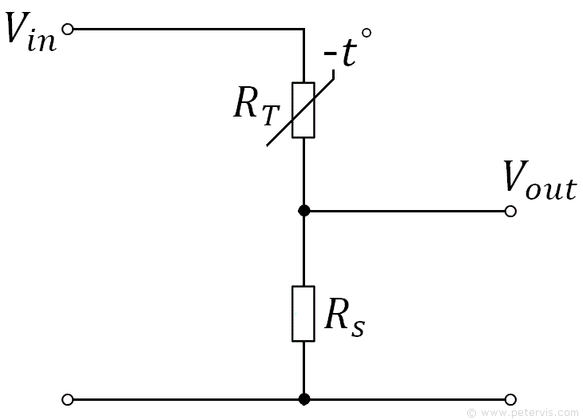

To obtain the thermistor resistance:

And temperature with Beta formula:

Or with Steinhart and Hart Equation if data is available:

### 9.8. Current

#### Hall effect

Hall effect sensors. Induced magnetic field is transformed into voltage. They are caracterized by their sensitivity

#### Shunt resistor

The voltage drop in the shunt resistor is amplified by a differential amplifier to obtain Vo

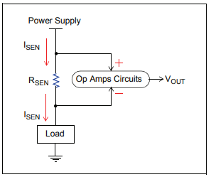

### 9.9. Air Speed

Air speed is measured with a differential pressure sensor 

Presssure is calculated with the sensor's transfer formula:

And the air speed using the Bernouilli formula:

After 2 seconds the sensor is calibrated to zero

Adjust constants in *pressure.h*:

- TRANSFER_SLOPE (B) as per sensor datasheet
- For fine tuning measure the Vcc on the sensor and adjust TRANSFER_VCC

### 9.10. Altitude

Altitude is calculated using the barometric formula:

*R = universal gas constant: 8.3144598 J/(mol·K)  
g = gravitational acceleration: 9.80665 m/s2  
M = molar mass of Earth's air: 0.0289644 kg/mol  
L = temperature lapse rate (K/m): 6.5 C/km  
T = temperature at h (K)  
Po = pressure at ground (Pa)*  

5 seconds after boot, pressure reference, Po, is set

## 10. Change log

v0.10

- Ported to RP2040

[v0.9](https://github.com/dgatf/msrc/tree/v0.9)

- HW V4/V5. Added throttle threshold and maximum current filters for current sensor. Values for current when throttle is low may not be reliable, depending on model
- Added consumption calculation. Thanks MJ666
- Fixed Jeti Ex bug
- HW V4/V5. Only one HW V4/V5 protocol. Voltage and current sensor parameters to be set manually
- Added RPM multipliers. Motor poles and gears (for helis) 
- Changed serial drivers timeout to microseconds for fast protocols (e.g. Jeti Ex)
- Allow additional Rx protocols & boards to be used with serial ESC and GPS. Use software serial only for Rx protocols, not sensors
- GPS. Added HDOP, sats, vario and distance to home
- IBUS. Fixed S32 type bug (GPS values)
- XBUS. Added analog voltage2/ntc2 sensor
- BMP280 and GPS. Added vertical speed calculation (vario)
- Current analog. Added consumption
- Added ESC support for APD F/HV/UHV
- Added Hitec protocol
- Fixed Futaba SBUS2
- Fixed Pololu compilation in Arduino IDE
- Improved msrc_gui
- Added support for MS5611

[v0.8](https://github.com/dgatf/msrc/tree/v0.8)

- Added specific drivers for hardware serial and software serial
- Added msrc_gui to create config.h (not all options are avaiable from gui)
- Added Rx protocols: Frsky D, Spektrum XBUS, Spektrum SRXL V5, Flysky Ibus, Futaba SBUS2, Multiplex Sensor Bus, Jeti Ex Bus
- Added support for ATmega328PB, ATmega2560, ATmega32U4, ARM Cortex M0+ and ARM Cortex M4
- Improved accuracy for PWM input (rpm) measurement
- Added ESCs support for: Kontronik Kosmic/Kolibri/JivePro
- Improved current calculation for HW V4/V5

[v0.7](https://github.com/dgatf/msrc/tree/v0.7)

- Added analog airspeed sensor (MPXV7002)
- Fixed Castle Link bug
- Removed BMP180
- Fixed flickering in color lcd displays

[v0.6](https://github.com/dgatf/msrc/tree/v0.6)

- Added GPS serial (BN220, BN880, NEO-M8N,...)

[v0.5](https://github.com/dgatf/msrc/tree/v0.5)

- Added Castle Link Live protocol
- Hobbywing V4/V5. Improved transformations for voltage and current depending on the model (thanks to Commodore8888)

[v0.4.1](https://github.com/dgatf/msrc/tree/v0.4.1)

- Fix Horus display

[v0.4](https://github.com/dgatf/msrc/tree/v0.4)

- Changed R3 resistor to 3.3k
- Support for [change_id_frsky](https://github.com/dgatf/change_id_frsky) to change the sensor id
- Support for I2C sensors 
- Improved code quality and performance
- [Smartport_library](https://github.com/dgatf/smartport) improved performance and abstract from the smartport protocol

[v0.3.1](https://github.com/dgatf/msrc/tree/v0.3.1)

- Added cell voltage average (HW V4/V5, VFAS sensor)
- Applied correct transformation for esc voltage, current and temperature (HW V4/V5)
- Changed averaging type from SMA to EMA
- Added esc protocol NONE
- Smartport protocol. Minor improvements

[v0.3](https://github.com/dgatf/msrc/tree/v0.3)

- Esc current sensor (EscA) added (HW V4/V5, 80A or higher)
- Averaging telemetry added
- Voltage2 sensor changed from A3 to A4
- Ntc2 sensor changed from Tmp1 to Tmp2
- Averaging governor added
- Refresh rate and averaging added to lua config script

## 11. Support

For issues use github:

[Issues](https://github.com/dgatf/msrc/issues)

For questions use the forums:

[RCGroups](https://www.rcgroups.com/forums/showthread.php?4088405-DIY-MSRC-Multi-sensor-telemetry-for-several-Rx-protocols#post48830585) 

[Helifreak](https://www.helifreak.com/showthread.php?t=908371)

[Openrcforums](https://www.openrcforums.com/forum/viewtopic.php?f=84&t=11911)

If you want to add support for new receiver protocol or new sensor, ask for it
